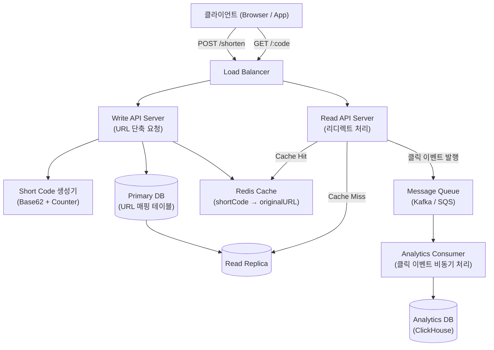
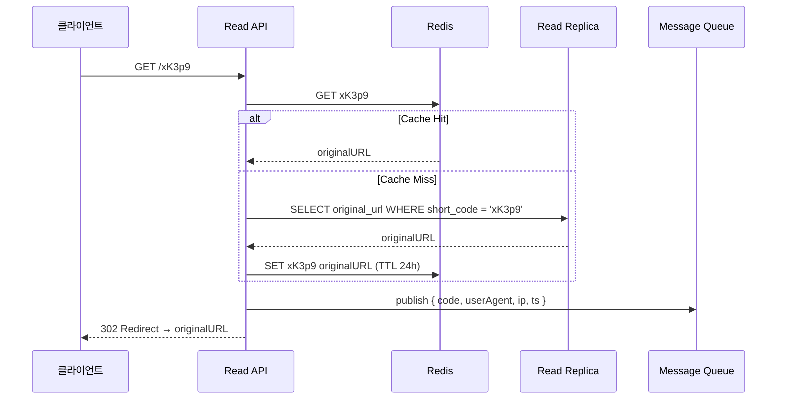
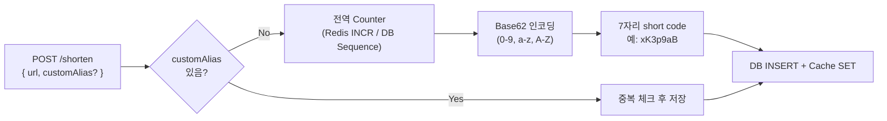

# URL 단축 서비스 아키텍처

## 개요

긴 URL을 짧은 코드(예: `sho.rt/xK3p9`)로 변환하고, 단축 URL에 접근하면 원본 URL로 리디렉트하는 서비스다. 읽기(리디렉트)가 쓰기(단축 생성)보다 압도적으로 많은 **읽기 중심(read-heavy)** 시스템이므로, 리디렉트 경로의 지연을 최소화하는 것이 핵심 설계 목표다.

## 다이어그램

### 전체 컴포넌트 구조



### 리디렉트 요청 흐름 (시퀀스)



### Short Code 생성 전략



## 설계 결정과 트레이드오프

### Short Code 생성 방식

| 방식 | 장점 | 단점 |
|---|---|---|
| **Hash (MD5/SHA + truncate)** | 구현 단순, 서버 무상태 | 충돌 가능성, 충돌 재시도 로직 필요 |
| **Counter + Base62 (채택)** | 충돌 없음, 순서 예측 가능 | Counter가 SPOF 될 수 있음 (분산 Counter 필요) |
| **UUID (Random)** | 분산 생성 쉬움 | 코드가 길어짐, 인덱스 단편화 |

**채택: Counter + Base62.** 충돌 처리 로직이 없어도 되고, 7자리 Base62는 최대 62^7 ≈ 3.5조 개의 URL을 표현할 수 있어 충분하다. Counter 단일 장애점은 Redis INCR(마스터 복제)로 완화하고, 각 Write 서버가 블록 단위(예: 1,000개)로 Counter를 미리 할당해 네트워크 왕복을 줄인다.

### 리디렉트 방식

- **302 (Temporary Redirect)**: 브라우저가 캐시하지 않아 클릭 횟수 정확히 측정 가능. 단, 매 요청이 서버를 통과해 트래픽 증가.
- **301 (Permanent Redirect)**: 브라우저가 캐시해 서버 부하 감소. 단, 클릭 분석 불가, URL 변경 시 대응 어려움.

**채택: 302.** 분석 데이터 수집과 운영 유연성이 더 중요하다.

### 캐시 전략

- **Write-through**: URL 단축 시 즉시 Cache에도 SET. 첫 리디렉트부터 캐시 히트 가능.
- **TTL**: 자주 쓰이는 URL은 자연히 캐시에 유지되고, 오래된 URL은 만료. 24시간 TTL 기본 적용.
- **캐시 미스 시 Read Replica 조회**: Primary DB 부하를 분산.

### 데이터베이스 스키마 (핵심)

```sql
CREATE TABLE url_mappings (
    id          BIGINT       PRIMARY KEY,  -- Counter 값 그대로 저장
    short_code  VARCHAR(10)  NOT NULL UNIQUE,
    original_url TEXT        NOT NULL,
    user_id     BIGINT,                    -- 생성자 (nullable, 비회원 허용)
    created_at  TIMESTAMP    NOT NULL DEFAULT NOW(),
    expires_at  TIMESTAMP,                 -- 만료 URL 지원
    is_active   BOOLEAN      NOT NULL DEFAULT TRUE
);
CREATE INDEX idx_short_code ON url_mappings(short_code);
```

### 확장성 고려

- **Write API / Read API 분리 배포**: 리디렉트 서버만 수평 확장 가능.
- **DB Read Replica**: 읽기 트래픽을 Replica로 분산.
- **Analytics 비동기 처리**: 리디렉트 응답 경로에서 클릭 집계를 제거해 지연 감소. Kafka를 통해 ClickHouse에 적재.

## 구현 언어 후보

| 언어 | 장점 | 단점 |
|---|---|---|
| **Go** | 낮은 지연, 높은 동시성(goroutine), 단일 바이너리 배포 | 생태계가 Java/Node보다 작음 |
| **Java (Spring Boot)** | 성숙한 생태계, 풍부한 DB 라이브러리 | 메모리 사용량 높음, 콜드 스타트 느림 |
| **Node.js (Fastify)** | I/O 바운드에 적합, 빠른 개발 속도 | CPU 집약적 작업 취약, 단일 스레드 한계 |

**추천: Go** — 리디렉트 서버는 DB/Cache 조회 후 즉시 응답하는 I/O 바운드 + 고동시성 패턴이다. Go의 goroutine 모델은 이 패턴에 이상적이며, 메모리 오버헤드가 낮아 동일 자원에서 더 많은 동시 요청을 처리할 수 있다. 단일 바이너리 배포로 컨테이너 이미지도 작게 유지된다.

## 다음 학습 방향 / 열린 질문

- **분산 Counter 구현**: Redis INCR만으로 충분한가, 아니면 Snowflake ID 같은 분산 ID 생성기가 필요한가?
- **커스텀 도메인**: 기업 고객이 자신의 도메인으로 단축 URL을 만들려면 어떤 라우팅 레이어가 필요한가?
- **만료(Expiry) 정책**: TTL이 지난 레코드를 DB에서 어떻게 효율적으로 정리할 것인가 (Soft Delete + 배치 vs. DB TTL 기능)?
- **Rate Limiting**: 단일 IP/사용자의 단축 URL 생성 남용을 어떻게 방어할 것인가?
- **보안**: 악성 URL 필터링(Google Safe Browsing API 연동 등)을 어느 단계에서 삽입할 것인가?
